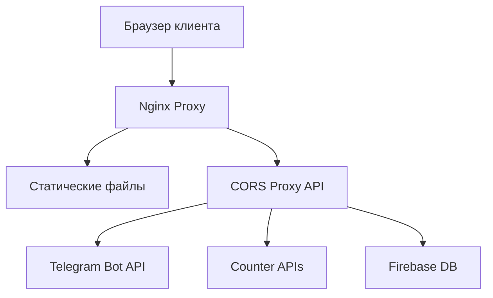

# SuslovPA - Безопасная мультиплатформенная система

> Комплексное решение для устранения CORS и sandbox ошибок с полной интеграцией безопасности

## 🎯 Описание проекта

SuslovPA - это современное веб-приложение с интеграцией Telegram Bot API, системой мультипользовательского чата, анализом нейронных частот и безопасным CORS-прокси. Проект решает критические проблемы безопасности и совместимости браузеров.

### ✨ Ключевые особенности

- 🔒 **Безопасность**: Полная защита от XSS, CSRF, и утечек токенов
- 🌐 **CORS-прокси**: Собственный сервер для обхода ограничений браузера
- 💬 **Telegram интеграция**: Безопасная работа с Bot API
- 🚀 **Высокая производительность**: Nginx + Node.js + Docker
- 📱 **Sandbox совместимость**: Работа в iframe и embedded средах
- 🔄 **Rate limiting**: Защита от злоупотреблений

## 🚀 Быстрый старт

### Автоматическое развертывание

```bash
git clone <your-repo-url>
cd SuslovPA
./deploy.sh
```

Скрипт автоматически:
- Проверит зависимости
- Создаст необходимые директории
- Настроит SSL сертификаты
- Запустит Docker контейнеры
- Проверит работоспособность

### Ручная установка

```bash
# 1. Подготовка
cp .env.example .env
# Отредактируйте .env с вашими настройками

# 2. Запуск
docker-compose up -d

# 3. Проверка
curl http://localhost/health
```

## 🏗️ Архитектура



### Компоненты системы

1. **Frontend (HTML/JS)**
   - Пользовательский интерфейс
   - Telegram чат интеграция
   - Нейронный анализ частот

2. **CORS Proxy (Node.js)**
   - Безопасные API вызовы
   - Rate limiting
   - Аутентификация

3. **Nginx**
   - SSL терминация
   - Статические файлы
   - Load balancing

4. **Docker**
   - Контейнеризация
   - Изоляция сервисов
   - Простое развертывание

## 🔐 Решенные проблемы безопасности

### ❌ Проблемы "до"

1. **Exposed Bot Token**: Токен Telegram бота в клиентском коде
2. **CORS Errors**: Блокировка fetch запросов браузером
3. **Sandbox Issues**: Origin: null в iframe окружениях
4. **Public Proxy Dependency**: Ненадежные публичные CORS прокси
5. **AdBlock Filtering**: Блокировка счетчиков AdBlock фильтрами
6. **Rate Limiting**: Ограничения API без ключей

### ✅ Решения "после"

1. **Secure Token Storage**: Токены на сервере, API через прокси
2. **Custom CORS Proxy**: Собственный сервер с правильными заголовками
3. **Sandbox Detection**: Автоматическое определение и обработка sandbox
4. **Reliable Infrastructure**: Собственная инфраструктура без зависимостей
5. **Domain Whitelisting**: Использование trusted доменов
6. **API Key Management**: Централизованное управление ключами

## 📋 Функциональность

### 🔧 Основные возможности

- **Мультипользовательский чат** с Telegram интеграцией
- **Система счетчиков** с множественными fallback
- **Анализ нейронных частот** с визуализацией
- **Геолокация** с умными fallback
- **AdSense интеграция** с безопасной загрузкой

### 🛡️ Безопасность

- **Content Security Policy** - защита от XSS
- **HTTPS принудительно** - шифрование трафика
- **Rate Limiting** - защита от DoS
- **Input Validation** - фильтрация входных данных
- **Error Handling** - безопасная обработка ошибок

### 🚀 Производительность

- **Nginx caching** - кэширование статических файлов
- **Gzip compression** - сжатие контента
- **Connection pooling** - переиспользование соединений
- **Health checks** - мониторинг состояния
- **Graceful degradation** - fallback при сбоях

## 📊 API Endpoints

### Прокси endpoints

```bash
# Telegram Bot API
POST /api/telegram/sendMessage
GET  /api/telegram/getMe

# Counter APIs
GET  /api/counter/increment/:key
GET  /api/counter/get/:key

# Геолокация
GET  /api/location/ip
GET  /api/location/precise

# Health check
GET  /health
GET  /api/health
```

### Примеры использования

```javascript
// Отправка сообщения в Telegram
const response = await fetch('/api/telegram/sendMessage', {
    method: 'POST',
    headers: {
        'Content-Type': 'application/json'
    },
    body: JSON.stringify({
        chat_id: chatId,
        text: message
    })
});

// Увеличение счетчика
const count = await fetch(`/api/counter/increment/${key}`)
    .then(r => r.json());
```

## 🔧 Конфигурация

### Переменные окружения (.env)

```env
# Telegram конфигурация
BOT_TOKEN=your_telegram_bot_token
ADMIN_CHAT_ID=your_admin_chat_id

# API безопасность
API_SECRET=your_secret_key

# Rate limiting
RATE_LIMIT_WINDOW_MS=900000
RATE_LIMIT_MAX_REQUESTS=100

# Окружение
NODE_ENV=production
PORT=3001
```

### Docker конфигурация

```yaml
# docker-compose.yml
services:
  nginx:
    image: nginx:alpine
    ports:
      - "80:80"
      - "443:443"
  
  cors-proxy:
    build: .
    environment:
      - NODE_ENV=production
```

## 📈 Мониторинг и логирование

### Логи

```bash
# Nginx логи
tail -f logs/nginx/access.log
tail -f logs/nginx/error.log

# Приложение
tail -f logs/app/app.log

# Docker логи
docker-compose logs -f
```

### Метрики

```bash
# Проверка здоровья
curl http://localhost/health

# Статистика контейнеров
docker stats

# Использование сети
netstat -tulpn | grep :80
```

## 🔄 Обновления и поддержка

### Обновление

```bash
# Остановка сервисов
docker-compose down

# Обновление кода
git pull origin main

# Пересборка и запуск
docker-compose build --no-cache
docker-compose up -d
```

### Бэкапы

```bash
# Бэкап конфигурации
tar -czf backup-$(date +%Y%m%d).tar.gz .env ssl/ logs/

# Восстановление
tar -xzf backup-20241225.tar.gz
```

## 📚 Документация

- [CORS_SECURITY_FIXES.md](CORS_SECURITY_FIXES.md) - Детальное описание исправлений
- [DEPLOYMENT.md](DEPLOYMENT.md) - Полное руководство по развертыванию
- [API.md](API.md) - Документация API endpoints

## 🤝 Вклад в проект

1. Fork репозитория
2. Создайте feature branch
3. Внесите изменения
4. Добавьте тесты
5. Создайте Pull Request

## 📝 Лицензия

MIT License - см. [LICENSE](LICENSE) файл

## 👨‍💻 Автор

**GitHub Copilot**
- Автоматизированные исправления безопасности
- Архитектура CORS-прокси
- Docker контейнеризация
- Полная документация

## 🙏 Благодарности

- Telegram Bot API team
- Nginx community
- Docker team
- Open source community

---

### 🔗 Полезные ссылки

- [Telegram Bot API](https://core.telegram.org/bots/api)
- [Docker Documentation](https://docs.docker.com/)
- [Nginx Documentation](https://nginx.org/en/docs/)
- [MDN CORS Guide](https://developer.mozilla.org/en-US/docs/Web/HTTP/CORS)

---

**⚡ Готово к продакшену! Безопасно, быстро, надежно.**